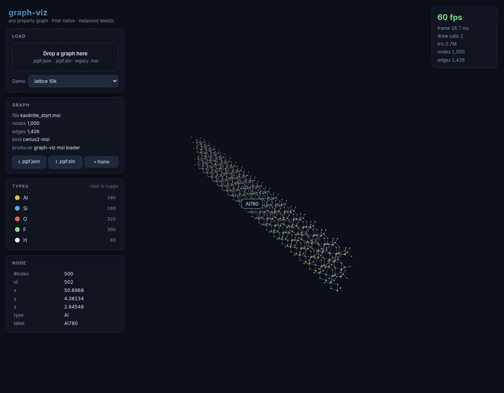

# graph-viz

Any property graph, in the browser, at scale. PGIF-native, instanced WebGL —
1M nodes interactive on a desktop GPU, 60 fps at 500k. The rebuild of the
dissertation's molecular viewer, generalized past molecules.



## Run

```bash
npm install
npm run dev          # http://localhost:5173
npm test             # vitest (loaders, codecs, layout)
npm run typecheck
```

Load a graph by drag-and-drop, the file picker, the demo menu, or a
`?demo=lattice:100k` / `?demo=social:10000` URL. Bundled sample: the kaolinite
KMC golden snapshot in all three formats under `public/`.

## Formats

- **`.pgif.json` / `.pgif.bin`** — [PGIF v0](docs/PGIF.md), the columnar
  property-graph interchange format shared with the Rust KMC port. Binary
  loads as zero-copy typed arrays.
- **`.msi`** — legacy CERIUS2, import-only. Convert out with
  `npm run msi2pgif -- file.msi [--json]`.

Graphs without `x/y/z` columns get a deterministic force layout in a worker —
a knowledge graph or social network renders as readily as a crystal.

## What it does

- **Scale**: one InstancedMesh for nodes, one for edges — 2 draw calls at any
  size; adaptive sphere detail by node count.
- **Types**: the categorical `type` column drives color/size — chemistry gets
  the classic element palette, anything else gets stable hashed colors; the
  legend toggles per-type visibility.
- **Inspect**: click a node for every column value (typed-array ray pick,
  no raycaster); the picked node gets a projected label.
- **Export**: any loaded graph saves back out as PGIF JSON or binary.

## Why it looks like this

The legacy viewer rendered 1,000 atoms at 28 fps on an RTX 4090 and died at
50k (0.5 fps, 71 s mount) — per-atom React components, not the GPU. The
instanced rewrite renders 1,000,000 at 30 fps on the same card. Numbers,
decisions, and the things deliberately not built: [docs/ARCHITECTURE.md](docs/ARCHITECTURE.md).

## Automation hooks

`window.__graphviz` exposes `ready`, `stats()`, `graph()`, `loadDemo(spec)`,
`loadText(name, text)`, `pickAtNdc(x, y)`, `projectNode(i)` — used by the
verification harness and handy for headless benchmarking.
