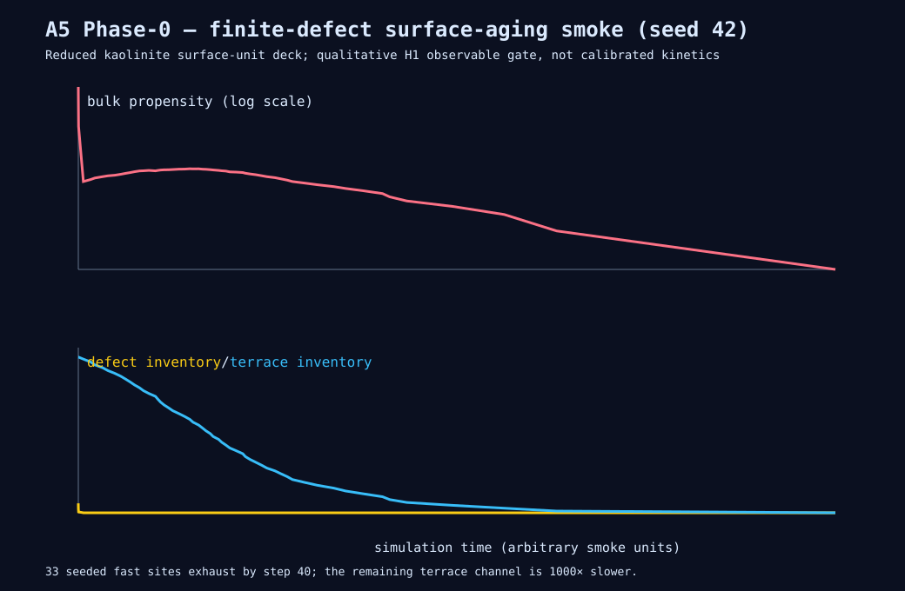

# A5 Phase 0: aging observables and finite-inventory smoke

**Date:** 2026-08-22

**Deck:** `petra/examples/kaolinite-aging-smoke.toml`

**Seed:** 42

**Purpose:** qualitative H1 instrumentation gate, not calibrated kaolinite kinetics



## What landed

Petra now records three experiment-facing observable families over a trajectory:

1. **Long-time rate spectra.** `rate_spectra` is sampled at every declared cadence and exported in deterministic site order to `observables.csv`.
2. **BET versus geometric area.** `surface_area` keeps projected geometric footprint separate from the BET-like exposed-site census. Internal roughening can therefore increase the BET proxy without inventing projected area.
3. **Per-site exposure age.** `exposure_age` is core-owned transition state. A newly exposed solid site is timestamped at the committing event's physical/strategy time, remains dated while continuously exposed, and is cleared when buried or removed. The reporter exports `current_time - exposed_since` without drawing RNG values.

The production 26-site `kaolinite.toml` and the Kossel etch-pit demo declare these observables. Solid-state aliases may include multiple kinds/states, which is required for the kaolinite state vocabulary.

## Smoke experiment

`kaolinite-aging-smoke.toml` is intentionally a reduced kaolinite surface-unit deck. It seeds a finite population of fast damaged sites only on the top basal face; after those sites dissolve, terrace retreat is 1,000 times slower and requires an existing edge. This isolates the inventory-depletion signature without pretending that the smoke deck has the chemistry or calibrated rates of the production 26-site deck.

Reproduction:

```bash
cd petra
export CARGO_TARGET_DIR=$(python3 /opt/data/workspaces/vsletten/mission-control/main/scripts/review_ready_teardown.py \
  --repo vsletten/dissertation --print-cargo-target)
cargo run -p petra-cli -- examples/kaolinite-aging-smoke.toml \
  --steps 600 --seed 42 --out ../docs/program/results/a5p0-aging-observables/raw --paranoid
cd ..
python3 petra/tools/summarize_aging_smoke.py \
  docs/program/results/a5p0-aging-observables/raw \
  docs/program/results/a5p0-aging-observables/summary.csv \
  docs/program/results/a5p0-aging-observables/aging-smoke.svg
```

The committed `summary.csv` and SVG were generated by that command. The full raw long-form export is reproducible and intentionally not committed.

## Result

| Sample | Defects | Terrace units | Bulk propensity | Geometric area | BET proxy | Mean exposure age |
|---|---:|---:|---:|---:|---:|---:|
| step 0 | 33 | 543 | 330.00 | 6629.904 | 288 | 0.000 |
| step 30 | 3 | 543 | 30.96 | 6629.904 | 288 | 0.258 |
| step 40 | 0 | 536 | 1.15 | 6629.904 | 292 | 5.144 |
| step 140 | 0 | 436 | 2.17 | 6629.904 | 348 | 50.164 |

As the 33-site fast inventory exhausts, bulk propensity falls from **330.0 to 1.15**: a **286.96× reduction (99.6515%)** by step 40. That is the requested qualitative H1 signature. The later slow-terrace channel is not monotone: its active edge grows temporarily, reaching propensity 2.47 around step 250 before declining as the finite slab disappears. This is useful rather than a failure—the observables distinguish inventory aging from geometric edge creation instead of forcing a one-parameter story.

The area accounting also behaves independently: projected geometric area stays at 6629.904 through the early roughening interval while the BET proxy rises from 288 to 348. Exposure-age means and p95 values grow in physical simulation time, while newly exposed sites enter at age zero.

## Verification

- The smoke ran with `--paranoid` and stopped honestly at step 576 when the finite slab had no events left.
- Focused observable tests cover exposure timestamps, projected-area/BET separation, deterministic long-time sampling, and the finite-defect rate decline.
- The production kaolinite build/dynamics golden tests remain green, proving instrumentation did not perturb the seeded trajectory contract.
