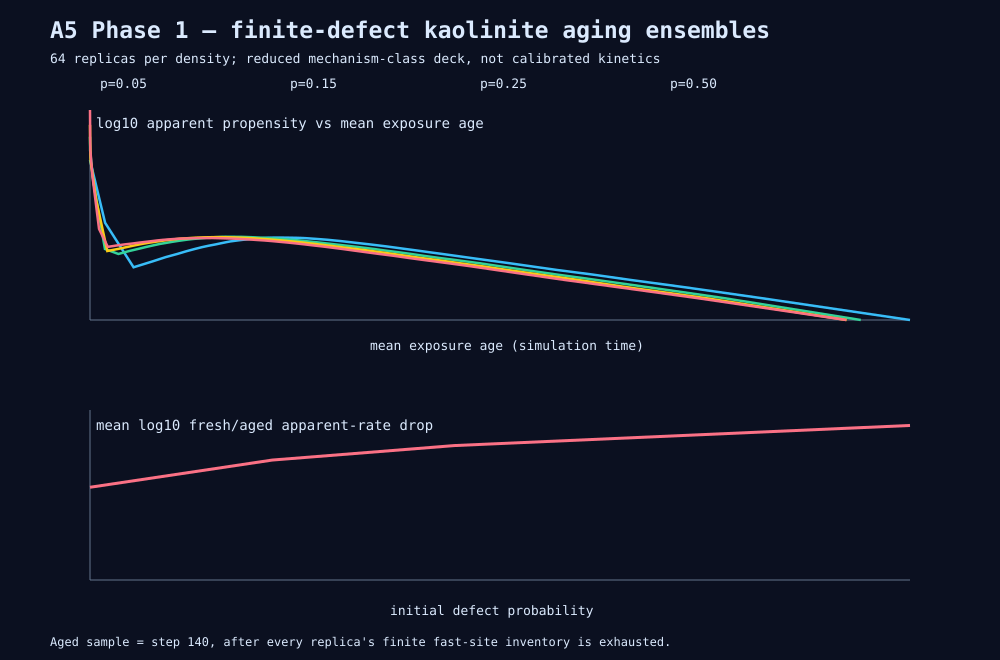

# A5 Phase 1: finite-defect kaolinite aging ensembles

**Date:** 2026-08-28<br>
**Model tier:** reduced mechanism-class deck; **not** calibrated kaolinite kinetics<br>
**Template:** `petra/examples/kaolinite-aging-smoke.toml`<br>
**Analysis:** `petra/scripts/aging_study.py`



## Question

Can depletion of a finite inventory of fast, damage-associated surface sites produce a sustained fresh-to-aged apparent-rate decline, and how strongly does that decline depend on the initial defect density?

This study uses A5p0's three observables together: instantaneous site-rate spectra, projected-geometric versus BET-like surface measures, and core-owned per-site exposure ages. It tests the mechanism class only. The deck assigns defects a `10.0` propensity and edge-gated terrace retreat a `0.01` propensity, so its three-order site-rate contrast is an explicit model assumption rather than a fitted mineral barrier.

## Campaign design

- Four top-surface defect probabilities: `0.05`, `0.15`, `0.25`, and `0.50` on a 12×12×4 (576-site) slab.
- 64 deterministic replicas per density, 256 trajectories total, using Petra's ordered `Increment` seed policy. Base seeds are 42000, 52000, 62000, and 72000 by density.
- Every trajectory requested 600 events and reached the honest no-events stop at step 576 after the finite slab dissolved. Cadence was 10 events.
- The predeclared **aged regime is step 140**. This is beyond the fast-site exhaustion knee for every replica: the bootstrap upper bound on the defect count is zero by steps 20, 40, 50, and 90 respectively as density increases.
- The apparent-rate drop is computed per replica as instantaneous total propensity at step 0 divided by that at step 140, then summarized with a deterministic 2,000-resample bootstrap 95% interval. The geometric- and BET-normalized ratios are computed independently rather than inferred from the total-rate ratio.

The complete long-form exports stay outside Git at `/opt/data/run-outputs/dissertation/A5p1-aging-study-20260828/` (20 files, 340,515,688 bytes). `MANIFEST.sha256` hashes every campaign input, log, and CSV; its SHA-256 is `e32d658b1857754aab06b5796c8a97a25221fc510621c24d0855876a5a674d58`.

## Fresh versus aged apparent rate

| Initial defect probability | Initial defects, mean [95% CI] | Fresh propensity, mean [95% CI] | Aged propensity, mean [95% CI] | Fresh/aged ratio, mean [95% CI] | log10 drop, mean [95% CI] |
|---:|---:|---:|---:|---:|---:|
| 0.05 | 7.64 [6.94, 8.31] | 76.41 [69.53, 83.75] | 2.080 [2.038, 2.119] | **36.36 [33.42, 39.28]** | 1.534 [1.495, 1.572] |
| 0.15 | 21.64 [20.56, 22.72] | 216.41 [205.47, 226.56] | 2.196 [2.168, 2.223] | **98.69 [93.76, 103.67]** | 1.984 [1.960, 2.006] |
| 0.25 | 36.78 [35.45, 38.09] | 367.81 [355.31, 381.09] | 2.175 [2.145, 2.204] | **169.93 [162.73, 177.27]** | 2.224 [2.205, 2.242] |
| 0.50 | 71.48 [69.86, 73.06] | 714.84 [699.53, 730.31] | 1.978 [1.954, 2.003] | **363.06 [352.55, 373.41]** | 2.557 [2.544, 2.570] |

The dependence is monotonic and large: increasing the initial fast-site inventory raises the fresh rate almost linearly, while all four aged ensembles converge near a propensity of two after the fast inventory has disappeared. The mean decline therefore grows from 36× at 5% defects to 363× at 50% defects.

Surface normalization does not remove the signal:

| Defect probability | Geometric-normalized drop [95% CI] | BET-normalized drop [95% CI] |
|---:|---:|---:|
| 0.05 | 35.52 [32.51, 38.48] | 42.88 [39.19, 46.70] |
| 0.15 | 97.18 [92.05, 102.41] | 117.82 [111.87, 123.92] |
| 0.25 | 168.54 [161.46, 175.18] | 201.86 [194.08, 209.62] |
| 0.50 | 361.10 [350.13, 371.90] | 415.85 [405.41, 426.80] |

BET normalization makes the aged surface look *less* reactive, not more: at step 140 the BET-like exposed-site census has risen from 288 to 331–344 (+14.77% to +19.49%) while projected geometric area has changed by only −0.55% to −2.46%. The model therefore reproduces the qualitative roughness paradox identified by White & Brantley: accessible area can rise while apparent reactivity falls.

## Rate-spectrum evolution

The initial spectrum contains only active defect sites at propensity `10`, so its mean is `log10(rate) = 1` with zero width. As defects disappear and edge-gated terrace events at `0.01` coexist with the remaining fast tail, the spectrum broadens transiently. The maximum population-mean log10 standard deviations are:

| Defect probability | Peak step | Peak log10 spectrum width |
|---:|---:|---:|
| 0.05 | 10 | 0.116 |
| 0.15 | 10 | 1.207 |
| 0.25 | 10 | 1.466 |
| 0.50 | 20 | 1.494 |

After the defect inventory is exhausted, the spectrum collapses onto the slow terrace channel at `log10(rate) = -2` with zero width. Thus this finite two-family model shows a three-order down-shift and transient broadening followed by narrowing. It does **not** show a continuously broad aged spectrum; that would require additional calibrated site families, strain distributions, or annealing channels beyond this card.

## Exposure-age distributions and area state at step 140

| Defect probability | Mean simulation time | Mean exposure age [95% CI] | Mean p95 exposure age [95% CI] | Geometric area | BET proxy |
|---:|---:|---:|---:|---:|---:|
| 0.05 | 117.55 | 91.22 [86.91, 95.59] | 117.55 [112.24, 122.92] | 6466.60 | 337.95 |
| 0.15 | 77.70 | 61.68 [59.81, 63.62] | 77.70 [75.29, 80.30] | 6527.03 | 344.14 |
| 0.25 | 62.81 | 50.64 [49.05, 52.26] | 62.81 [60.73, 64.85] | 6573.07 | 342.72 |
| 0.50 | 41.06 | 35.10 [33.94, 36.33] | 41.06 [39.65, 42.57] | 6593.22 | 330.55 |

The higher-density ensembles reach 140 events in less physical time because their initial total propensity is larger. Exposure age nevertheless grows continuously after sites become exposed, and the p95 tracks the oldest still-exposed surface population. `aging-curves.csv` preserves the complete cadence-by-cadence means and bootstrap bands for rate, spectrum, exposure age, geometric area, and BET proxy.

## Verdict on the field–lab discrepancy

**At this mechanism tier, finite fast-site depletion is a plausible partial explanation, not a complete attribution.** Moderate-to-high initial damage (`p = 0.15–0.50`) produces about **2.0–2.6 log units** of apparent-rate decline, enough to overlap the lower end of the program's published 2–4-order field–lab range (the broader scoping literature reports up to five orders). The low-density surface produces only 1.53 log units. No run reaches the upper 4–5-order gap.

That is a mechanism result, not a kaolinite prediction. The deck's fixed 1,000× defect/terrace rate contrast largely sets the attainable ceiling; it has no transport limitation, near-equilibrium thermodynamic suppression, passivating altered layer, or QM-grounded site-family barrier distribution. The honest conclusion is therefore: **surface aging alone can generate the lower few orders in a deliberately finite-inventory model and its magnitude depends strongly on fresh-surface damage, but these runs cannot establish what fraction of a real field–lab gap belongs to the lattice.** Phase 2 calibration and the later discrepancy budget must test that quantitative claim.

## Reproduction

```bash
cd <dissertation-worktree>
CARGO_TARGET_DIR=$(python3 /opt/data/workspaces/vsletten/mission-control/main/scripts/review_ready_teardown.py \
  --repo vsletten/dissertation --print-cargo-target)
export CARGO_TARGET_DIR
export OMP_NUM_THREADS=16 MKL_NUM_THREADS=16 OPENBLAS_NUM_THREADS=16 RAYON_NUM_THREADS=16
cargo build -p petra-cli --manifest-path petra/Cargo.toml

RAW=/opt/data/run-outputs/dissertation/A5p1-aging-study-20260828
python3 petra/scripts/aging_study.py run \
  petra/examples/kaolinite-aging-smoke.toml \
  "$CARGO_TARGET_DIR/debug/petra" "$RAW"
python3 petra/scripts/aging_study.py analyze \
  "$RAW" docs/program/results/a5p1-aging-study
```

The runner uses `nice -n 10`, caps Rayon and numerical-library threads at 16, writes one durable log per density, refuses to overwrite an existing campaign directory, and fails closed if any step-140 replica still contains a defect.

## Verification

- 256/256 ensemble trajectories reached the finite slab's honest no-events state at step 576; each final population is 576 empty sites.
- Analysis tests cover exact deck generation, deterministic ratio/band aggregation, area normalization, distribution extraction, and the aged-regime defect gate.
- `python3 -m unittest discover -s petra/scripts/tests -v`: **22 passed**, including 3 new aging-study tests.
- `cargo test --workspace` in `petra/`: **116 passed, 0 failed**, including seeded 20k-step kaolinite and Kossel bitwise-parity gates and A5p0 observable regressions.
- `cargo clippy --workspace --all-targets -- -D warnings` and `cargo fmt --all --check`: pass.
- The committed SVG parses as XML; generated CSVs and the external raw campaign are manifest-hashed.
